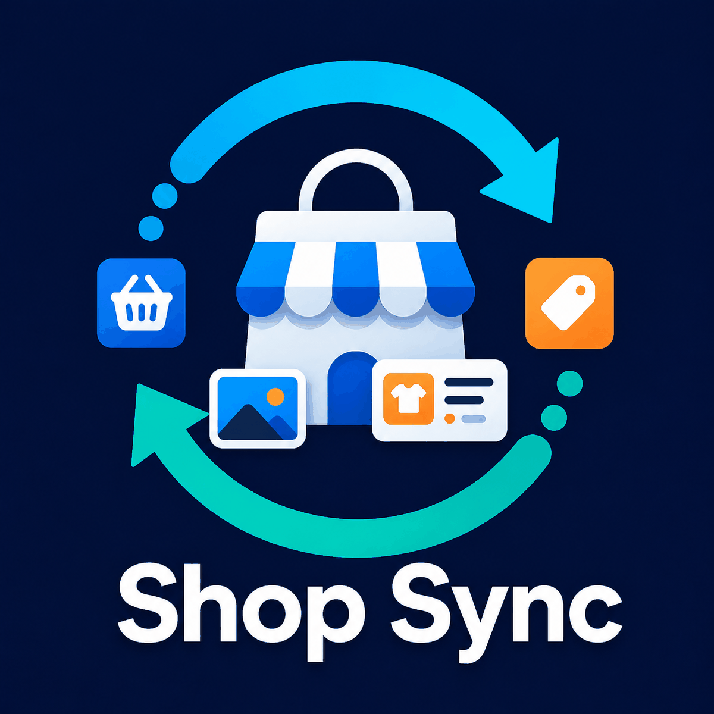

# Shop Sync: eBay, Etsy, TikTok Shop and Shopify

[](LICENSE)

<p align="center">
  
</p>

Shop Sync is a Home Assistant OS app for importing marketplace listings and creating Shopify drafts. Version `0.0.25` uses a simple eBay connection: **normal users do not need an eBay Developer account, App ID, Cert ID, RuName or manually generated eBay token**. They connect their own seller account through the publisher-managed Shop Sync eBay OAuth application.

> [!IMPORTANT]
> Shop Sync is still a development preview. Test with a small number of listings and review every Shopify draft before publishing it. Continuous order/stock synchronisation and reverse marketplace publishing are still planned work.

## What users need

### Home Assistant

- Home Assistant OS with custom Apps/Add-ons support.
- This repository added to the Home Assistant App Store.
- Shop Sync installed, started and optionally shown in the sidebar.

### eBay

Normal users only need:

- An eBay account with the seller listings they want to import.
- Permission to approve Shop Sync on that eBay account.

They **do not** need:

- An eBay Developer Program account.
- App ID / Client ID.
- Cert ID / Client secret.
- RuName.
- A manually generated production user token.

### Shopify

For the destination Shopify store, the user currently needs to create/install a Shopify app with:

```text
write_products,write_inventory,read_locations
```

They then enter the store's permanent `.myshopify.com` domain, Client ID and Client secret into Shop Sync.

### Etsy

Etsy currently still requires the shop owner to create an Etsy developer app and supply its keystring/shared secret. The callback URL is:

```text
https://adya84.github.io/Marketplace-Shop-Sync-eBay-Etsy-Shopify/etsy-callback.html
```

### TikTok Shop

TikTok Shop currently requires the app key, app secret, seller access token and shop cipher from TikTok Shop Partner Center. A development app can only authorise development shops until TikTok approves the app for live use.

## What version 0.0.25 does

- Imports active eBay UK listings using OAuth user consent.
- Uses the publisher-managed Shop Sync eBay OAuth application for end-user sign-in.
- Forces a fresh eBay login when **Connect eBay** is selected so the correct seller account can be chosen.
- Removes all eBay developer credential fields from the normal user flow.
- Stores each seller's eBay access/refresh credentials locally in the Shop Sync Home Assistant app data.
- Renews short-lived eBay access tokens automatically through the hosted OAuth broker.
- Imports eBay titles, HTML descriptions, category data, item specifics, photos, variations, SKUs, prices and available quantities.
- Skips eBay listings that eBay has removed or made unavailable instead of aborting the whole catalogue import.
- Reports how many removed/unavailable eBay listings were skipped when the import completes.
- Imports active Etsy listings through Open API v3 and renews Etsy OAuth tokens automatically.
- Imports active TikTok Shop products.
- Imports the Shopify catalogue for duplicate review and comparison.
- Creates Shopify products as drafts, including variants, inventory and media where supported.
- Provides duplicate-title review before draft creation.
- Supports individual and bulk Shopify draft creation.
- Shows connection state and background-job activity in Home Assistant Ingress.

## Install Shop Sync in Home Assistant OS

1. Open **Settings > Apps > App Store**.
2. Open the three-dot menu and choose **Repositories**.
3. Add:

   ```text
   https://github.com/Adya84/Marketplace-Shop-Sync-eBay-Etsy-Shopify
   ```

4. Close the repository dialog and refresh the App Store if necessary.
5. Select **Shop Sync** and choose **Install**.
6. Start Shop Sync.
7. Enable **Start on boot**, **Watchdog**, **Auto update** and **Show in sidebar** as desired.
8. Open **Shop Sync** from the Home Assistant sidebar.

Shop Sync is a custom Home Assistant app, not a HACS integration.

## Updating an existing installation

For users upgrading from `0.0.24` or earlier:

1. Open **Home Assistant > Settings > Apps > Shop Sync**.
2. Refresh the custom app repository if Home Assistant does not immediately show the new version.
3. Install/update to `0.0.25` or later.
4. Restart Shop Sync.
5. Reopen the Shop Sync sidebar page.

The old eBay App ID, Cert ID and RuName fields are no longer required for a normal eBay connection.

## Connect eBay — normal user instructions

Users installing Shop Sync do **not** need to register with the eBay Developer Program.

1. Open **Shop Sync**.
2. Select **Connect eBay**.
3. Shop Sync asks the hosted Shop Sync OAuth service for the official eBay sign-in URL.
4. Sign in to the eBay seller account you want Shop Sync to access.
5. If eBay displays the Shop Sync permission screen, review it and select **Agree and Continue**. eBay may reuse an existing grant for an account that has already approved Shop Sync.
6. eBay redirects to the Shop Sync callback page.
7. Select **Copy authorization result**.
8. Return to Shop Sync.
9. Paste the copied value into **Authorization result**.
10. Select **Finish eBay connection**.
11. The eBay panel should turn green **Connected**.

The authorization result is short-lived and single-use. If it expires, is reused or fails state validation, select **Connect eBay** again and complete a fresh authorization.

Shop Sync requests the eBay basic API scope and **Sell Inventory** scope. After approval, Shop Sync stores the seller's refresh credential locally so the user does not need to sign in again every time the short-lived access token expires.

## Connect Shopify

1. Create/install a Shopify app for the destination store.
2. Give it these scopes:

   ```text
   write_products,write_inventory,read_locations
   ```

3. Release/activate the Shopify app version and install it on the store.
4. Find the permanent `.myshopify.com` store domain.
5. Enter the store domain, Client ID and Client secret in Shop Sync.
6. Select **Test and save**.
7. Shopify should show green **Connected**.

Shop Sync obtains and renews short-lived Shopify Admin API tokens automatically.

## Connect Etsy

1. Sign in to the Etsy Developer Portal with the account that owns the shop.
2. Create an Etsy Open API v3 seller app.
3. Configure this callback URL:

   ```text
   https://adya84.github.io/Marketplace-Shop-Sync-eBay-Etsy-Shopify/etsy-callback.html
   ```

4. Enter the Etsy keystring and shared secret in Shop Sync.
5. Select **Connect Etsy**.
6. Approve the Etsy consent screen.
7. On the callback page select **Copy authorization result**.
8. Return to Shop Sync, paste it into **Authorization result** and select **Finish Etsy connection**.
9. Shop Sync discovers the authorised Shop ID and renews Etsy access tokens automatically.

## Connect TikTok Shop

1. Create/configure a TikTok Shop app in TikTok Shop Partner Center.
2. Obtain the app key and app secret.
3. Authorise the seller shop and obtain the seller access token.
4. Obtain the selected shop's `cipher` value.
5. Enter the app key, app secret, seller access token and shop cipher into Shop Sync.
6. Select **Test and save**.

TikTok's live seller access depends on the app's approval/publication status.

## Import listings and create Shopify drafts

1. Connect Shopify and at least one source marketplace.
2. Select the matching import action under **Import catalogues**.
3. Watch **Activity** until the import completes.
4. eBay listings that have been removed or become unavailable are skipped automatically; the rest of the import continues.
5. Review imported products and any entries under **Review duplicate titles**.
6. Start with one product and select **Create Shopify draft**.
7. Check the resulting Shopify draft carefully, including title, description, photos, variants, SKUs, prices and inventory.
8. Once satisfied, select multiple products to queue additional drafts.

Shop Sync deliberately creates Shopify drafts rather than immediately publishing products.

## eBay publisher / OAuth broker setup

> [!NOTE]
> This section is only for the Shop Sync publisher/operator. Normal Shop Sync users should ignore it.

The public Home Assistant repository must **never contain the eBay Cert ID/client secret**. Shop Sync therefore uses a hosted OAuth broker.

Production broker:

```text
https://shop-sync-ebay-oauth.graffidoodle.workers.dev
```

Health check:

```text
https://shop-sync-ebay-oauth.graffidoodle.workers.dev/health
```

Before releasing/testing Shop Sync it must report:

```json
{"status":"ok","configured":true}
```

The Cloudflare Worker holds these server-side variables/secrets:

```text
EBAY_CLIENT_ID=<Shop Sync production App ID>
EBAY_CLIENT_SECRET=<Shop Sync production Cert ID>
EBAY_RUNAME=<Shop Sync production RuName>
BROKER_SIGNING_SECRET=<long random secret>
```

The eBay **Auth accepted URL** and **Auth declined URL** should both be:

```text
https://shop-sync-ebay-oauth.graffidoodle.workers.dev/api/ebay/oauth/callback
```

The eBay Client ID, Cert ID and broker signing secret must never be committed to GitHub or shipped inside the Home Assistant app. The Home Assistant app only contains the public broker URL.

The broker provides OAuth start, callback, code exchange and refresh endpoints. Callback results are signed, short-lived and validated again by the Home Assistant app using the original OAuth state.

See [`oauth_broker/README.md`](oauth_broker/README.md) for operator/deployment details.

## Security and privacy

- Never commit eBay Cert IDs/client secrets, marketplace access tokens or refresh tokens to GitHub.
- The eBay client secret belongs only on the hosted OAuth broker.
- Seller OAuth credentials are stored in the Home Assistant app's private persistent data through Shop Sync's installation-specific authenticated credential wrapper.
- OAuth tokens are not intentionally returned by the status API or written to application logs.
- Saved secret fields intentionally appear blank after a page reload.
- Users can revoke Shop Sync access from the relevant marketplace account where supported.
- See [PRIVACY.md](PRIVACY.md) for the Shop Sync privacy policy.

## Troubleshooting

- **Home Assistant still shows the old eBay App ID/Cert ID/RuName form:** update Shop Sync to `0.0.25` or later and restart the app.
- **Connect eBay cannot open:** check the broker health URL and confirm it reports `configured:true`.
- **Authorization result rejected:** select **Connect eBay** again; callback results expire and are single-use.
- **eBay state mismatch:** discard the result and start a fresh connection.
- **eBay approval returns to the wrong page:** the publisher should verify both eBay accepted/declined URLs point to the Cloudflare callback.
- **Removed eBay listing stops an import:** update to `0.0.25` or later. Removed/unavailable listings are skipped and the import continues.
- **eBay import later fails authentication:** reconnect if the seller revoked access or the long-lived refresh token expired.
- **Shopify says `write_products` is required:** verify the active Shopify app version includes `write_products`, reinstall it and restart Shop Sync.
- **Etsy authorization fails:** start a fresh Etsy connection because its authorization code is single-use.
- **Saved secret fields look blank:** this is intentional; check the green/red connection status instead.

## Development

The Home Assistant service uses Python, FastAPI and SQLite.

```bash
cd marketplace_bridge
python -m pip install -r requirements.txt pytest
BRIDGE_DATA_DIR=./data python -m uvicorn app.main_v2:app --reload --port 8099
pytest app/tests
```

The installable Home Assistant app is in `marketplace_bridge/`. The eBay OAuth broker is deployed separately so the eBay client secret is never shipped to Home Assistant users.

## Not implemented yet

- Automatic Shopify-to-eBay stock reconciliation.
- eBay order ingestion and automatic stock deductions.
- Shopify-to-eBay listing creation.
- Shopify-to-Etsy listing creation.
- Scheduled reconciliation, webhooks and automatic retries.
- A HACS companion integration.

## Support

Use [GitHub Issues](https://github.com/Adya84/Marketplace-Shop-Sync-eBay-Etsy-Shopify/issues) for reproducible bugs and feature requests. Remove tokens, personal data, order details and customer information before posting logs or screenshots.

## Licence

Copyright (C) 2026 Adrian Apel. All rights reserved.

Shop Sync is provided under the [Shop Sync Home Assistant App Licence](LICENSE). It can be used free of charge on your own Home Assistant installation to manage marketplace accounts and stores you own or are authorised to operate. Redistribution, rebranding, resale, publication of modified versions, paid hosting and inclusion in paid products or services require prior written permission.
